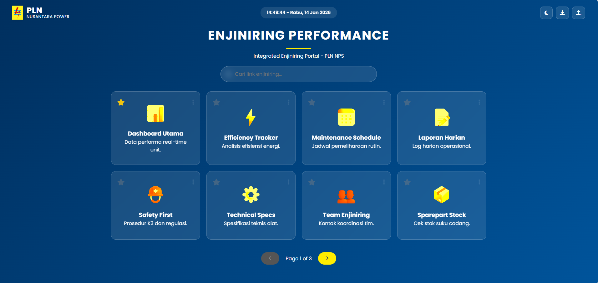

# Enjiniring Performance - Integrated Portal PLN NPS ⚡

Portal Dashboard terintegrasi yang dirancang khusus untuk tim **Enjiniring Performance di PLN Nusantara Power Services**. Aplikasi web ini berfungsi sebagai hub pusat untuk mengakses berbagai alat analisis, jadwal pemeliharaan, dan dokumentasi teknis secara efisien.

---

## 🚀 Fitur Utama

- **Manajemen Link Pintar (CRUD)**: Menambah, mengedit, dan menghapus tautan portal penting dengan mudah.
- **Sistem Merge Data Otomatis**: Secara cerdas menggabungkan link terbaru dari pembaruan kode tanpa menghapus link yang sudah ditambahkan pengguna secara manual.
- **Pencarian Real-Time**: Mencari link berdasarkan nama atau deskripsi secara instan melalui bar pencarian.
- **Sistem Favorit & Sorting**: Menandai link favorit yang secara otomatis akan naik ke posisi atas untuk akses lebih cepat.
- **Mode Terang/Gelap (Adaptive UI)**: Dilengkapi dengan toggle tema yang menyesuaikan warna teks logo dan latar belakang secara otomatis.
- **Widget Jam & Tanggal Digital**: Menampilkan waktu real-time yang presisi tepat di tengah dashboard.
- **Ekspor & Impor Data**: Fitur cadangan data ke format `.json` untuk memudahkan sinkronisasi antar perangkat rekan kerja.
- **Animasi Presisi**: Interaksi mikro pada ikon bintang dan menu yang hanya aktif saat kursor berada tepat di atas elemen.

---

## 🛠️ Teknologi yang Digunakan

- **HTML5**: Struktur semantik untuk aksesibilitas maksimal.
- **CSS3 (Custom Properties & Glassmorphism)**: Desain modern menggunakan efek kaca transparan dan variabel CSS untuk tema dinamis.
- **Vanilla JavaScript (ES6+)**: Logika pemrosesan data, manipulasi DOM, dan sistem penyimpanan tanpa bantuan library eksternal.
- **LocalStorage API**: Penyimpanan data permanen di browser pengguna.
- **FontAwesome & Google Fonts**: Tipografi Poppins dan ikonografi profesional.

---

## 📸 Tampilan Antarmuka

### Mode Gelap

*Tampilan identitas biru-kuning khas PLN pada mode gelap.*

### Mode Terang

*Tampilan bersih dengan teks korporat berwarna biru pada mode terang.*

---

## 🛠️ Teknologi yang Digunakan

- **HTML5**: Struktur semantik untuk aksesibilitas maksimal.
- **CSS3 (Custom Properties & Glassmorphism)**: Desain modern menggunakan efek kaca transparan dan variabel CSS untuk tema dinamis.
- **Vanilla JavaScript (ES6+)**: Logika pemrosesan data, manipulasi DOM, dan sistem penyimpanan tanpa bantuan library eksternal.
- **LocalStorage API**: Penyimpanan data permanen di browser pengguna.
- **FontAwesome & Google Fonts**: Tipografi Poppins dan ikonografi profesional.

---

## 📂 Struktur Proyek

```text
├── index.html          # File utama (Logic, Style, & Structure)
├── PLN.png             # Logo utama perusahaan
├── Screenshoot/        # Folder dokumentasi gambar
│   ├── image1.jpg      # Screenshot Mode Gelap
│   └── image2.jpg      # Screenshot Mode Terang
└── README.md           # Dokumentasi proyek
```

---

## 🎯 Cara Penggunaan
- **Menambah Link**: Klik tombol "Tambah Link" di halaman terakhir, isi detailnya, dan simpan.
- **Favorit**: Klik ikon bintang pada kartu untuk menaruhnya di barisan paling depan.
- **Backup**: Gunakan tombol unduh (ikon download) di pojok kanan atas untuk mengekspor daftar link kamu ke file JSON.
- **Restore**: Gunakan tombol unggah (ikon upload) untuk memasukkan kembali daftar link dari file backup.

---
Developed with ❤️ by Gilang Mahasiswa Teknik Komputer ITS - Surabaya, 2026*
